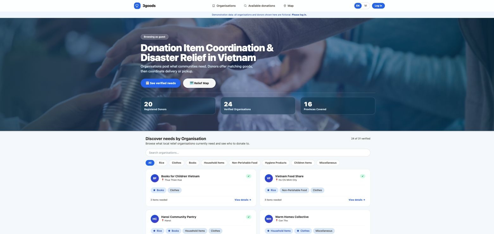
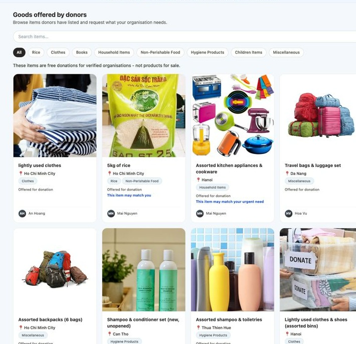
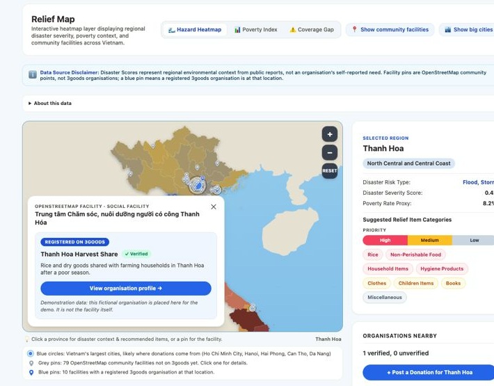
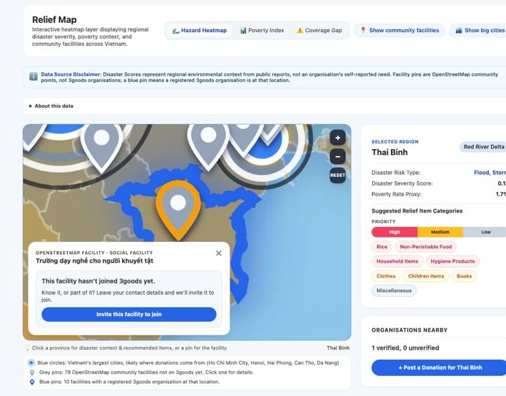

# 3goods

*A Data for Life 2026 Hackathon project for coordinating donations between donors and organisations.*

[Try the live site](https://3goods.vercel.app/)

## Why we built it

Data for Life 2026 gave us a social-security problem statement from the 86th Command, Ministry of National Defence: build a system that coordinates donations based on actual needs. The hackathon was backed by AI Singapore and introduced to us through NUS-ISS.

The problem felt close to home. My teammate and I have both volunteered for a long time, so community-service problems like this one are close to our hearts. In this problem, generous donations can still miss the people they are meant to help. One organisation may receive too much of the wrong thing while another still faces a shortage.

We started with that gap and asked a simple question: what if organisations could say what they need, and donors could see where their items would be most useful?

## From an idea to a prototype

We brainstormed the donor and organisation journeys together, worked through the matching idea, and built the prototype with Claude Code Pro subscription in roughly four days.

The web application uses React, JavaScript, Vite, Tailwind CSS and Supabase, and is deployed on Vercel. A custom SVG map and small serverless API present data from OpenStreetMap, EM-DAT, UNDP/MOLISA and GADM. Python scripts were used offline to clean, combine and score the source data before the resulting map datasets were published for the JavaScript application.

This is a two-person prototype, not a finished donation service. It is our attempt to make the handoff between generosity and real need clearer, and to help every useful item find a more thoughtful next home.

## If you are donating

You begin with the item you already have. Browse what organisations currently need, list an item you can give, and contact an organisation when there is a potential match. When you list an item, you also say how it gets there: happy to deliver, or pickup only, so the organisation knows what to arrange. If one organisation does not need it, the item remains available for other organisations to discover and request. A small act of giving becomes easier when the next step is just a conversation.

## If you are an organisation

With an organisation account, you can publish what your community currently needs and mark the most urgent needs as priorities. When you browse items offered by donors, matching labels show which items may fit your organisation's needs. You can request an item, chat with the donor, and coordinate the handoff directly.

## How the map works

Python data-processing scripts combine disaster exposure, regional poverty proxies, geographic boundaries and mapped facilities into deployment-ready datasets. The live map is rendered in the browser with JavaScript and reads those datasets through a small Vercel API, with a bundled fallback copy.

## Please enjoy using the site

The prototype is live at: [3goods.vercel.app](https://3goods.vercel.app/)
- ⁠Video: [3goods.vercel.app/video](https://3goods.vercel.app/video)
- ⁠Pitch deck: [3goods.vercel.app/about-us](https://3goods.vercel.app/3goods-proposal.pdf)

We hope it makes the distance between a generous person and a real need a little shorter.
